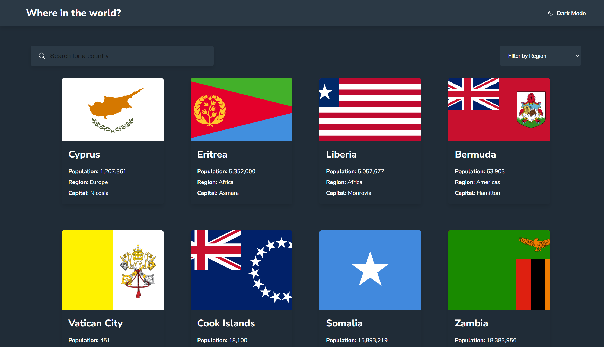

<h1 align="center">Rest Countries API with Color Theme Switcher</h1>

challenge from <a href="https://www.frontendmentor.io">Frontend Mentor</a>

<h2 align="center"><a href="https://fm-rest-countries-api1.netlify.app/">🚀Live Site</a>||<a href="./README-jp.md">🇯🇵日本語のREADMEはこちら</h2></a>

This web application lets you see and search for countries you would like to see from  <a href="https://restcountries.com">REST Countries API</a>

## 💡Key Features

User should be able to:

- See all countries from the API on the homepage
- Search for a country using an `input` field
- Filter countries by region
- Click on a country to see more detailed information on a separate page
- Click through to the border countries on the detail page
- Toggle the color scheme between light and dark mode

## ⚒️Built with

- HTML
- SASS
- JavaScript
